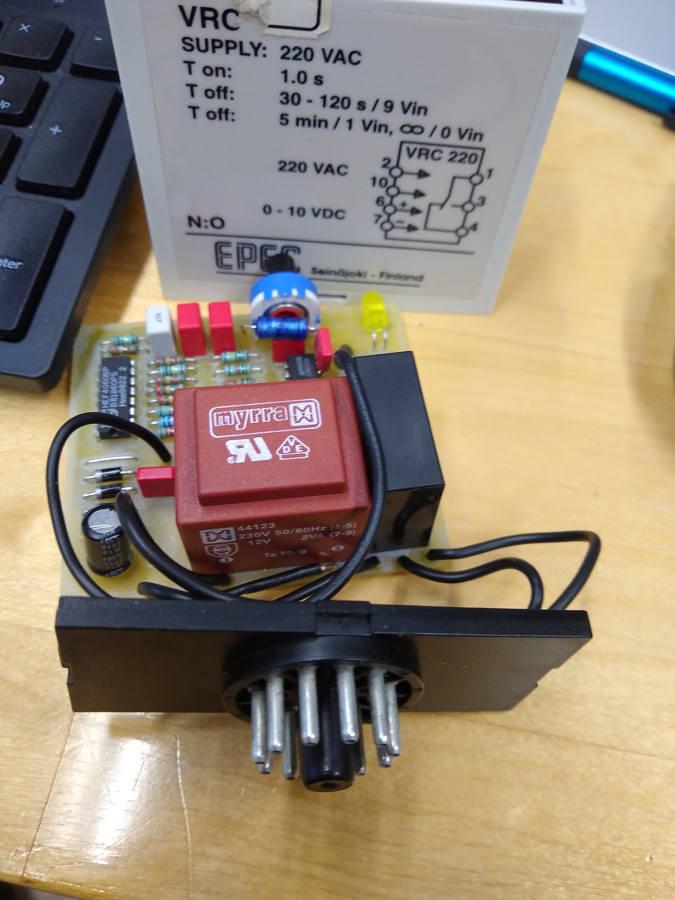

# EPEC VRC 220 V

This repo is for whoever may try to find information about this timer relay made by EPEC in Seinäjoki - Finland.

## Notes

- Operating voltage is much closer to 10 V than 12 V
- **HEF4060BP** is
4-stage ripple-carry binary counter/divider and oscillator
- **LM10CN** is
Operational Amplifier and Voltage Reference
- Pinout:
    1. Relay pole
    2. Mains AC input
    3. Relay N/O contact
    4. Relay N/C contact
    5. Not connected
    6. 0-10 V control input positive
    7. 0-10 V control input negative
    8. Not connected
    9. Not connected
    10. Mains AC input
    11. Not connected
- Connect external DC-voltage to pins 6 & 7 to control the off-time.
- Off-time when Vin is > 9 V may be 15 s even though the print has 30-120 s.
    - Time stays consistent when not turning the 10k potentiometer.
- On-time did vary between 1-2 s in some scenarios.
